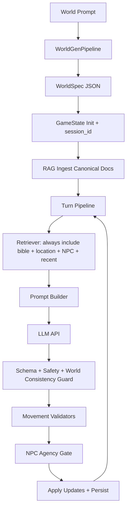

# Adaptive RPG Storytelling Prototype (LLM + Prompt Engineering + RAG)

A thesis-driven RPG prototype that generates a **coherent medieval‑fantasy world** before play, then runs a **map‑based, location‑aware chat RPG**. The system uses an **API LLM** (OpenAI‑compatible) plus **prompt engineering**, **RAG memory**, and **engine‑side enforcement** (movement validators + NPC agency gate). The UI is **Streamlit** with Start → World Prompt → Generate → Play.

## Features
- **Streamlit UI**: Start button, chat panel, map/location panel
- **World Generation before play**: world bible + map + NPC roster + starting hook
- **Map navigation**: click locations, see NPCs present
- **NPC chat**: dialogue per location, can affect world state
- **NPC movement enforcement**: legality + reachability + agency gate
- **Persistence**: state and turn logs stored per session
- **RAG**: strict always‑include policy (world bible + location + NPC + recent summaries)
- **API-only LLM**: OpenAI‑compatible base_url + api_key + model

---

## Two‑Phase Architecture
**Phase A — World Generation**
`WorldGenPipeline(world_prompt) → WorldSpec (validated) → GameState init → RAG ingest → Persist`

**Phase B — Turn Pipeline**
`player_action → retrieval → prompt → LLM → validate → apply updates → persist → log`



---

## Data Models (Strict Minimal Fields)

### LocationSpec (mandatory)
- `location_id` (stable id like `loc_001`)
- `name`
- `kind` enum: `town | dungeon | landmark | shop | forest | castle | bridge | …`
- `description` (short lore)
- `connected_to` (graph edges for reachability)
- `tags` (optional)

Example:
```json
{
  "location_id": "loc_003",
  "name": "Elderwood",
  "kind": "forest",
  "description": "A misty forest where ancient trees whisper.",
  "connected_to": ["loc_001", "loc_004"],
  "tags": ["danger", "mystic"]
}
```

### NPCProfile (with agency)
- `npc_id`, `name`, `profession/class`, `traits`, `goals`, `starting_location`
- **Agency fields**:
  - `obedience_level` ∈ [0..1]
  - `stubbornness` ∈ [0..1]
  - `risk_tolerance` ∈ [0..1]
  - `disposition_to_player` ∈ [-5..+5]
  - `refusal_style`

Example (stubborn NPC):
```json
{
  "npc_id": "npc_007",
  "name": "Garron",
  "profession": "Blacksmith",
  "traits": ["stubborn", "honest"],
  "goals": ["finish the iron gate"],
  "starting_location": "loc_001",
  "obedience_level": 0.2,
  "stubbornness": 0.9,
  "risk_tolerance": 0.3,
  "disposition_to_player": 0,
  "refusal_style": "blunt and unwavering"
}
```

### GameState (runtime)
- `world_bible`, `world_rules/taboos`
- `locations` (LocationSpec list)
- `npc_profiles` (NPCProfile list)
- `player_location`
- `npc_locations` (derived at runtime)
- `quests/flags`, `inventory` (optional)
- `session_id`

---

## JSON Schemas (Strict)

### WorldSpec (WorldGen output)
The LLM must return strict JSON validated by `rpg_story/world/schemas.py`.
Minimal requirements:
- world bible rules
- locations (LocationSpec)
- NPC roster (NPCProfile)
- starting hook + starting location

### TurnOutput (per‑turn output)
```json
{
  "narration": "...",
  "npc_dialogue": [{"npc_id": "...", "line": "..."}],
  "world_updates": {
    "player_location": "optional_location_id",
    "npc_moves": [
      {
        "npc_id": "...",
        "from_location": "...",
        "to_location": "...",
        "trigger": "player_instruction|story_event",
        "reason": "player_request|story_event",
        "permanence": "temporary|until_further_notice|permanent"
      }
    ]
  },
  "memory_summary": "short summary",
  "safety": {"refusal": false, "reason": ""}
}
```

### Example: LLM proposes move → engine rejects
LLM proposes:
```json
{
  "npc_id": "npc_007",
  "from_location": "loc_001",
  "to_location": "loc_003",
  "trigger": "player_instruction",
  "reason": "player_request",
  "permanence": "temporary"
}
```
Engine rejects (stubborn NPC):
```
Reason: npc_refused (stubbornness high, goal misaligned)
Action: do NOT apply move; log refusal; narrate refusal via LLM.
```

---

## NPC Movement Legality + Reachability Checks
Before applying **any** `npc_moves`:
1. `npc_id` exists
2. `from_location` matches `npc_locations[npc_id]`
3. `to_location` exists in world locations
4. `to_location` reachable through `connected_to` graph
   - unless world bible explicitly allows special travel

**Engine enforces this.** The LLM only proposes moves.

---

## Persistence (Mandatory)
After world generation and after every turn:
- `data/sessions/<session_id>/state.json` (overwrite)
- `data/sessions/<session_id>/turns.jsonl` (append)

Session lifecycle:
- `session_id` generated at world creation
- UI loads from persisted `state.json`

---

## RAG Injection Policy (Strict)
Every turn prompt MUST include:
1. **World bible rules** (always)
2. **Current location doc** (always)
3. **Target NPC profile** (always when talking)
4. **Recent N turn summaries** (always)
5. **Optional top_k memories** filtered by `location_id` and `npc_id`

Metadata fields for docs:
- `doc_type`: `world_bible | location | npc_profile | turn_summary | event`
- `session_id`
- `location_id` (optional)
- `npc_id` (optional)
- `turn_id` (optional)
- `timestamp`

---

## Setup & Run
### .env template
```
LLM_API_KEY=your_api_key
LLM_BASE_URL=https://api.example.com
LLM_MODEL=gpt-5
```

### Install
```bash
python -m venv .venv
source .venv/bin/activate
pip install -r requirements.txt
```

### Run Streamlit UI (primary)
```bash
streamlit run rpg_story/ui/streamlit_app.py
```

### Optional CLI mode
```bash
python -m rpg_story.cli --config configs/config.yaml
```

---

## Code Modules (Enforcement)
- `rpg_story/engine/validators.py`: movement legality + reachability checks
- `rpg_story/engine/agency.py`: deterministic NPC acceptance gate
- `rpg_story/persistence/store.py`: save/load/append logs
- `rpg_story/rag/retriever.py`: strict always‑include injection policy

---

## License / Citation Note
No license file is included yet. Add one if required. Cite referenced papers in the final thesis/report.
