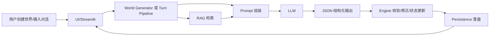
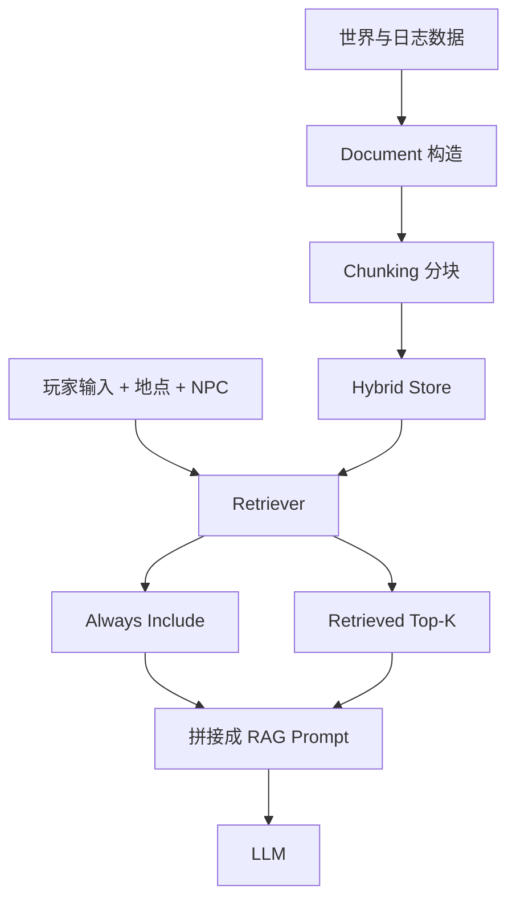

# 项目进度汇报说明

本文档基于当前代码实现整理，适合向老师汇报目前系统已经完成的核心工作、技术路线和实现细节。项目本质上是一个“`LLM + 游戏引擎约束 + RAG 记忆检索 + 持久化状态`”的叙事 RPG 原型，不是单纯把大模型接到聊天框里，而是让大模型参与世界生成、对话叙事和局部决策，同时由引擎负责可执行规则和状态一致性。

---

## 1. 系统整体架构

### 1.1 模块划分

- `rpg_story/world/`：世界生成、清洗、语义修复、初始化
- `rpg_story/engine/`：回合编排、状态更新、移动校验、NPC agency 控制
- `rpg_story/llm/`：大模型调用、JSON schema 约束、JSON 修复
- `rpg_story/rag/`：知识文档构造、分块、索引、混合检索
- `rpg_story/persistence/`：会话状态、回合日志、故事总结持久化
- `rpg_story/ui/`：Streamlit 前端，包括地图、对话、采集、交付
- `rpg_story/models/`：`WorldSpec`、`GameState`、`TurnOutput` 等数据契约

### 1.2 总体数据流



### 1.3 核心思想

系统采用了“职责拆分”的设计：

- 大模型负责生成世界、生成 NPC 台词、给出候选的世界更新建议。
- 引擎负责判断这些建议是否可以真正执行。
- RAG 负责给模型补充上下文，减少遗忘和设定漂移。
- 持久化层负责把每次对话和状态变化写入文件，使系统可以恢复、回放和总结。

因此，这个系统不是让 LLM 直接“掌控游戏”，而是让它在可控框架中发挥生成能力。

---

## 2. 系统两条核心链路

### 2.1 世界生成链路

整体流程：

`world_prompt -> LLM 生成 WorldSpec -> sanitize/validate -> 语义修复 -> 初始化 GameState -> 落盘`

具体对应代码逻辑：

1. `rpg_story/world/generator.py::generate_world_spec`
   - 根据用户输入的世界描述，调用 LLM 生成 `WorldSpec` JSON。
   - 使用 `WorldSpec.model_json_schema()` 作为输出约束。
2. `sanitize_world_payload`
   - 清洗模型输出中的结构错误、类型错误、非法字段。
3. `validate_world` 和 `find_anachronisms`
   - 检查地点连通性、引用合法性、时代违和词等。
4. `_enforce_world_language` 与 `_polish_world_semantics`
   - 如果语言不一致或者有占位 NPC 名称、占位物品名，就再次调用 LLM 做“修复式重写”。
5. `_ensure_story_structures`
   - 强制主线依赖支线奖励。
   - 规范 NPC 密度、职业、唯一命名、地图布局。
6. `initialize_game_state`
   - 生成初始 `npc_locations`、`quest_journal`、`main_quest_id`、空背包等运行态。
7. `create_new_session`
   - 把 `world.json` 和 `state.json` 写到 `data/` 下。

### 2.2 对话回合链路

整体流程：

`玩家输入 -> RAG 上下文 -> Prompt 组装 -> LLM 输出 TurnOutput -> Guard/Validator -> 状态更新 -> 持久化`

核心入口是 `rpg_story/engine/orchestrator.py::TurnPipeline.run_turn`。

主要步骤：

1. 调 `RAGRetriever.get_forced_context_pack()` 取上下文。
2. 拼接 system prompt、narrator prompt、NPC persona prompt、RAG 文本。
3. 用 JSON schema 调 LLM，要求输出 `TurnOutput`。
4. 对输出做一致性修复：
   - 身份一致性
   - 世界 roster 一致性
   - 任务物品 grounding
   - 时代违和词修复
5. `apply_turn_output()` 更新：
   - `recent_summaries`
   - `flags`
   - `inventory`
   - `quest_journal`
   - `npc_personality`
6. `validate_npc_move()` 检查移动是否合法。
7. `apply_agency_gate()` 判断 NPC 是否愿意配合移动。
8. 将合法结果写回 `npc_locations`，并写日志、写状态文件。

这条链路体现了本系统最关键的一点：**模型输出的是“候选动作”，最终是否生效由引擎裁决。**

---

## 3. Prompt Engineering 是怎么用的

### 3.1 Prompt 不是一段固定文本，而是分层拼接

当前实现里，Prompt Engineering 不是简单写一句“你是一个 NPC”，而是由多个部分动态组合：

1. 基础系统约束：`rpg_story/prompts/system_base.txt`
2. 叙事风格约束：`rpg_story/prompts/narrator.txt`
3. NPC 个体 persona：`rpg_story/prompts/npc_persona.txt`
4. RAG 检索出来的世界/地点/NPC/记忆上下文
5. 本回合动态状态信息：地点、背包、任务、NPC 当前人格、邻接地点等

这意味着 Prompt 里既有静态规则，也有当前回合的运行时事实。

### 3.2 Prompt Engineering 的核心目标

当前 Prompt 设计主要解决以下问题：

- 保证输出一定是结构化 JSON。
- 保证 NPC 不串身份、不乱认人。
- 保证语言统一，中文世界就持续中文输出。
- 保证 NPC 只说当前世界里存在的人、地点、物品。
- 保证任务物品和任务发布者对应正确。
- 让模型可以输出“人格变化”和“移动建议”，但必须在规则内。

### 3.3 对话 Prompt 的关键注入内容

在 `TurnPipeline._build_prompts()` 中，用户侧 prompt 包含了这些关键信息：

- 当前地点 `location_id`
- 当前对话 NPC `npc_id`、`npc_name`
- NPC 当前真实位置 `npc_current_location`
- 玩家输入 `player_text`
- 是否曾经见过该 NPC
- 是否对该 NPC 有过强迫/威胁历史
- 当前背包
- 当前任务日志
- 该 NPC 负责的任务
- 当前 NPC 的人格参数
- 世界中允许出现的物品列表
- 最近记忆摘要
- 地图和邻接地点

这相当于把“游戏状态快照”喂给了模型，而不是只给一小段聊天历史。

### 3.4 Prompt Engineering 的第二层：重写式修复

如果模型首次输出有问题，系统不会立刻崩溃，而是会触发二次修复：

- `generate_json()` 先尝试直接解析 JSON
- 失败后调用“JSON repair tool”风格 prompt 再修一次
- 如果对话内容违反身份、任务、世界设定，还会触发 guard rewrite

所以这里的 Prompt Engineering 不是单次生成，而是“生成 + 自动修复”的组合策略。

---

## 4. 与 LLM 交流使用的 JSON 格式是什么

这里实际上有两层 JSON：

1. 发给模型接口的请求 JSON
2. 模型必须返回的业务 JSON

### 4.1 发给模型接口的请求 JSON

项目通过 OpenAI Compatible 方式调用 Qwen，核心请求体等价于：

```json
{
  "model": "qwen3-max",
  "messages": [
    {
      "role": "system",
      "content": "系统提示词"
    },
    {
      "role": "user",
      "content": "用户提示词"
    }
  ],
  "temperature": 0.7,
  "top_p": 0.95,
  "stream": false,
  "response_format": {
    "type": "json_schema",
    "json_schema": {
      "name": "TurnOutput",
      "schema": {}
    },
    "strict": true
  }
}
```

其中最关键的是 `response_format.type = json_schema`，这会强约束模型按 schema 返回 JSON。

### 4.2 世界生成阶段的业务 JSON：`WorldSpec`

世界生成时，模型要返回的核心结构是：

```json
{
  "world_id": "world_xxx",
  "title": "世界标题",
  "world_bible": {
    "tech_level": "medieval",
    "narrative_language": "zh",
    "magic_rules": "魔法规则",
    "tone": "叙事基调",
    "anachronism_policy": "时代违和策略",
    "taboos": [],
    "do_not_mention": [],
    "anachronism_blocklist": []
  },
  "locations": [
    {
      "location_id": "loc_001",
      "name": "地点名",
      "kind": "town",
      "description": "地点描述",
      "connected_to": ["loc_002"],
      "tags": ["market"]
    }
  ],
  "npcs": [
    {
      "npc_id": "npc_001",
      "name": "NPC 名字",
      "profession": "职业",
      "traits": ["谨慎", "守规矩"],
      "goals": ["保住商铺"],
      "starting_location": "loc_001",
      "obedience_level": 0.6,
      "stubbornness": 0.4,
      "risk_tolerance": 0.2,
      "disposition_to_player": 0,
      "refusal_style": "委婉拒绝"
    }
  ],
  "starting_location": "loc_001",
  "starting_hook": "开场钩子",
  "initial_quest": "初始任务",
  "main_quest": {},
  "side_quests": [],
  "map_layout": [
    {
      "location_id": "loc_001",
      "x": 50,
      "y": 60
    }
  ]
}
```

### 4.3 对话阶段的业务 JSON：`TurnOutput`

对话回合时，模型必须返回：

```json
{
  "narration": "场景描述",
  "npc_dialogue": [
    {
      "npc_id": "npc_001",
      "text": "NPC 对玩家说的话"
    }
  ],
  "world_updates": {
    "player_location": null,
    "npc_moves": [
      {
        "npc_id": "npc_001",
        "from_location": "loc_001",
        "to_location": "loc_002",
        "trigger": "player_instruction",
        "reason": "同意带路",
        "permanence": "temporary",
        "confidence": 0.82
      }
    ],
    "flags_delta": {
      "met_npc_001": true
    },
    "quest_updates": {},
    "quest_progress_updates": [],
    "inventory_delta": {
      "healing_herb": 1
    },
    "npc_personality_updates": [
      {
        "npc_id": "npc_001",
        "obedience_level": 0.65,
        "stubbornness": 0.35,
        "risk_tolerance": 0.25,
        "disposition_to_player": 1,
        "refusal_style": "愿意配合但保持警惕",
        "confidence": 0.7,
        "reason": "玩家刚刚帮助了 NPC"
      }
    ]
  },
  "memory_summary": "本回合的短摘要，用于后续记忆检索",
  "safety": {
    "refuse": false,
    "reason": null
  }
}
```

### 4.4 这里最值得强调的点

- `npc_moves` 不是直接执行，而是候选移动。
- `inventory_delta` 会进入状态更新流程，但它主要依赖 schema、Prompt grounding 和后续状态合并，不像 NPC 移动那样有专门的路径合法性校验。
- `npc_personality_updates` 给的是目标值，不是增量。
- `memory_summary` 是给 RAG 记忆系统用的，不只是给玩家看的总结。

---

## 5. RAG 的原理与结构

### 5.1 为什么要做 RAG

如果只靠聊天历史，系统会出现几个问题：

- 对话变长后遗忘前文
- NPC 人设漂移
- 任务物品和地点信息混乱
- 世界设定被模型“脑补”篡改

RAG 的作用就是把关键知识重新塞回 prompt，让模型每回合都看到足够稳定的上下文。

### 5.2 当前 RAG 结构



### 5.3 文档来源

在 `rpg_story/rag/sources/` 中，系统把不同信息变成统一的 `Document`：

- `world_docs.py`：世界观、主支线、NPC roster
- `location_docs.py`：当前地点描述
- `npc_docs.py`：该 NPC 的人格参数和身份说明
- `summaries.py`：过去若干回合的摘要
- `memories.py`：历史对话和叙事记忆
- `npc_memories.py`：和当前 NPC 强相关的历史互动
- `lore_docs.py`：额外导入的外部 lore 文档

### 5.4 检索策略

当前检索不是单一向量检索，而是 `lexical + vector + recency` 的混合检索：

- `lexical`：关键词重合度
- `vector`：embedding 语义相似度
- `recency`：最近发生的内容优先

综合分数大致是：

`hybrid_score = lexical_weight * lexical + vector_weight * vector + recency_weight * recency`

### 5.5 强制注入和检索补充

`RAGRetriever.get_forced_context_pack()` 把上下文分成两类：

1. `always_include`
   - 世界 bible
   - 当前地点
   - 当前 NPC profile
   - 当前 NPC 的近期记忆
   - 最近摘要
2. `retrieved`
   - 依据玩家输入、地点、NPC 检索到的 memory/summary/lore

这样做的好处是：

- 保证最重要的设定每回合必定出现
- 同时允许系统按当前问题动态召回历史信息

### 5.6 分块与持久化

- 长文本会按字符数切块，并保留 overlap，减少跨块语义断裂。
- 默认存到 `data/vectorstore/<session_id>/hybrid_store.json`。
- 回合日志写在 `data/sessions/<session_id>/turns.jsonl`，后续可再生成记忆文档。

因此，这个 RAG 其实是一个“会持续生长的会话记忆库”。

---

## 6. 大模型是怎么控制背包内部物品和 NPC 位置的

这个问题最适合在汇报时重点说明：**大模型不是直接改状态，而是输出建议，引擎决定是否采纳。**

### 6.1 背包控制机制

背包变化主要有三类来源：

1. `采集`
   - 由 UI 显式触发。
   - 从 `location_resource_stock` 中扣除资源，再加入 `inventory`。
2. `交付`
   - 由 UI 中的 `Deliver to Current NPC` 显式触发。
   - 调用 `deliver_items_to_npc()`，不是聊天自动交付。
3. `剧情型物品变化`
   - 模型可以在 `TurnOutput.world_updates.inventory_delta` 中建议加减物品。
   - 最后由 `apply_turn_output()` 合并进背包。

### 6.2 为什么“聊天不能直接完成任务交付”

代码中专门写死了这个规则：

- 聊天阶段 Prompt 明确要求：
  - `Do NOT increase collected_items_delta for item delivery in chat`
- 真正的任务交付只能通过 `deliver_items_to_npc()` 完成。

这样设计的原因是：

- 避免模型一句话就把任务物品“吞掉”
- 避免玩家没有明确操作却被系统偷偷扣物品
- 保持可解释性和可控性

### 6.3 地点资源与背包的关系

每个地点都有 `location_resource_stock`：

- 初次进入某地点时，系统根据该地点对应任务需求和世界资源池初始化可采集物品。
- 玩家采集时，从地点库存扣减。
- 资源 depletion 会持久保存，不会每次刷新。

所以物品系统不是纯文本，而是有状态库存的。

### 6.4 NPC 位置控制机制

模型如果认为 NPC 应该移动，会在 `world_updates.npc_moves` 中输出：

- 谁移动
- 从哪里移动
- 移到哪里
- 触发原因
- 置信度

但是这个移动要经过两层约束：

1. **硬规则校验**
   - `validate_npc_move()` 检查：
     - `npc_id` 是否存在
     - `from_location` 是否和当前状态一致
     - `to_location` 是否存在
     - 地图上是否可达
2. **agency 决策**
   - `apply_agency_gate()` 和 `decide_npc_move()` 根据 NPC 人格参数判断是否愿意移动

只有通过这两层，`npc_locations[npc_id]` 才会真正更新。

### 6.5 NPC 移动不是随机的，而是受人格参数影响

是否配合移动，主要受以下变量影响：

- `obedience_level`：服从度越高越容易移动
- `stubbornness`：固执度越高越容易拒绝
- `risk_tolerance`：风险容忍度越低，越不愿去危险地点
- `disposition_to_player`：对玩家好感越低，越容易拒绝
- `profession/goals`：守卫、商人、医者等岗位型角色更不愿离岗

所以这里的 NPC 行为已经从“脚本式移动”变成了“人格参数驱动的可解释决策”。

---

## 7. NPC 的性格是怎么通过对话改变的

### 7.1 模型输出人格更新建议

在对话 Prompt 中，系统允许模型输出：

```json
{
  "npc_personality_updates": [
    {
      "npc_id": "npc_001",
      "obedience_level": 0.65,
      "stubbornness": 0.35,
      "risk_tolerance": 0.25,
      "disposition_to_player": 1,
      "refusal_style": "更愿意合作",
      "confidence": 0.7,
      "reason": "玩家帮助了他"
    }
  ]
}
```

这表示模型认为，本轮互动后，这个 NPC 的态度应该发生变化。

### 7.2 引擎如何真正应用这个变化

真正生效时，系统不是直接覆盖，而是“按置信度平滑融合”：

- 浮点型人格参数用 `_blend_float()`
- 整型好感度用 `_blend_int()`
- `confidence` 越高，越接近模型给出的目标值

例如：

- 原本 `obedience_level = 0.4`
- 模型给出 `0.8`
- `confidence = 0.5`

那么最终不会直接跳到 `0.8`，而是向 `0.8` 靠近一部分。

### 7.3 为什么这样设计

如果直接覆盖，会有两个问题：

- 性格跳变太剧烈，不像真实角色
- 模型偶发输出错误时，角色会瞬间“性格崩坏”

采用平滑融合后，NPC 的人格会表现出“缓慢演化”的效果，更像长期互动关系。

### 7.4 性格变化会影响什么

它不是只写在日志里，而是会影响后续系统行为：

1. 后续 Prompt 中会重新注入当前人格参数
2. 后续 NPC 移动决策会读取这些参数
3. NPC 的拒绝方式 `refusal_style` 也可能改变
4. 对玩家的态度会影响语气和是否愿意配合

也就是说，当前系统已经实现了“对话 -> 人格变化 -> 后续行为改变”的闭环。

---

## 8. 本系统当前最值得汇报的技术亮点

### 8.1 不是纯聊天，而是“可执行叙事系统”

项目已经把大模型输出接入到：

- 地图
- 背包
- 任务
- NPC 位置
- NPC 性格
- 故事记忆

这比普通角色聊天 Demo 更接近“可运行的游戏系统”。

### 8.2 用 JSON schema 约束模型输出

相比让模型返回自由文本，本系统已经做到：

- 结构化输出
- 自动解析
- 自动修复
- 失败可定位

这对工程化非常重要。

### 8.3 LLM 与规则引擎分工清晰

这点在汇报时建议重点强调：

- LLM 负责创造性生成
- Engine 负责执行正确性
- RAG 负责上下文稳定

这是一种比较适合游戏 AI 的架构。

### 8.4 RAG 不只是查资料，而是会话记忆系统

这里的 RAG 不是单纯检索知识库，而是同时融合：

- 世界设定
- 当前地点
- 当前 NPC
- 历史摘要
- 历史对话
- 外部 lore

所以它更像“动态记忆层”。

---

## 9. 汇报时建议特别说明的几个点

### 9.1 建议的讲述顺序

汇报时可以按下面顺序讲，会比较清楚：

1. 先讲项目目标：做一个 LLM 驱动的叙事 RPG 原型。
2. 再讲核心架构：`LLM + Engine + RAG + Persistence`。
3. 再讲一个完整回合怎么跑。
4. 然后重点展开：
   - Prompt Engineering
   - JSON schema 输出
   - RAG 记忆
   - 背包/位置/人格控制
5. 最后讲当前完成度和下一步优化方向。

### 9.2 建议老师最容易关心的问题

老师大概率会问：

- 为什么不能直接让大模型自由发挥？
  - 回答：因为游戏需要可执行状态和规则一致性，所以必须有引擎层。
- 为什么要做 JSON 输出？
  - 回答：因为这样才能把模型结果映射成任务、物品、移动等系统状态。
- RAG 和普通聊天历史有什么区别？
  - 回答：RAG 是结构化、多来源、可检索、可持久化的记忆增强，不只是上下文拼接。
- NPC 性格变化是不是伪装的？
  - 回答：不是。人格参数会真实写回状态，并影响之后的 Prompt 和移动决策。

### 9.3 可以主动承认的当前局限

如果老师追问不足，可以主动说明：

- 目前 NPC 性格变化主要体现在数值参数和拒绝/配合行为上，还没有形成更复杂的长期社会关系网络。
- 目前 RAG 仍是单会话为主，跨会话长期记忆还可以继续做。
- 目前地图和资源系统是轻量级实现，未来可以继续丰富事件和战斗系统。

主动说明局限通常会显得对系统边界很清楚。

---

## 10. 一句话总结

当前项目已经完成了一个较完整的原型：使用大模型生成世界和对话，使用 JSON schema 把模型输出结构化，使用 RAG 维持世界记忆与上下文一致性，使用引擎对任务、背包、NPC 位置和人格变化进行硬约束和持久化管理，从而实现了一个“可控、可运行、可扩展”的 LLM 叙事 RPG 系统。
