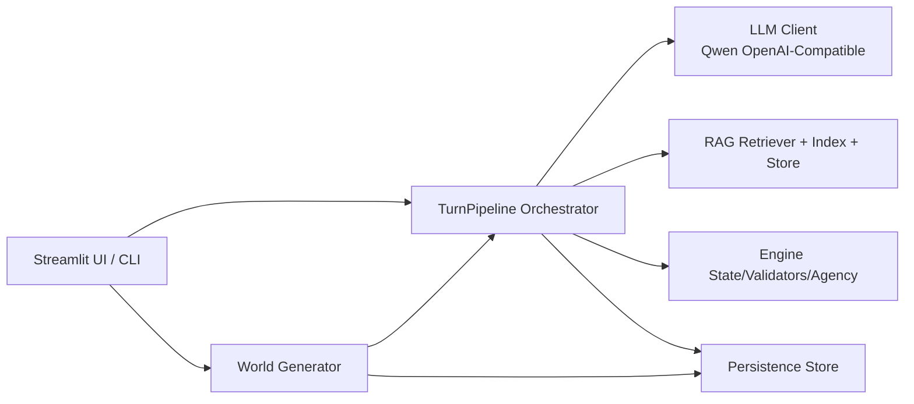

# Final_Project 系统架构说明

## 1. 项目定位

本项目是一个 **LLM 驱动的叙事 RPG 原型**，目标是把“模型生成能力”与“可执行游戏规则”结合起来，实现：

- 世界生成（多题材）
- NPC 对话与行为演化
- 任务/物品/地图联动
- 记忆检索（RAG）与状态持久化

核心原则是：

- `LLM` 负责生成和叙事
- `Engine` 负责规则约束和状态一致性
- `RAG` 负责上下文补充，降低长对话漂移

---

## 2. 分层架构总览

模块对应目录：

- `rpg_story/ui/`：前端交互（Streamlit）
- `rpg_story/world/`：世界生成、清洗、语义修复、初始化
- `rpg_story/engine/`：回合编排、状态更新、行动校验、NPC agency
- `rpg_story/rag/`：文档构建、分块、混合检索、向量存储
- `rpg_story/llm/`：模型调用与 JSON 输出修复
- `rpg_story/persistence/`：会话状态和日志落盘
- `rpg_story/models/`：`WorldSpec/GameState/TurnOutput` 数据契约

---

## 3. 两条核心业务链路

## 3.1 世界创建链路（初始化阶段）

`world_prompt -> generate_world_spec -> _ensure_story_structures -> initialize_game_state -> 持久化`

关键步骤：

1. `world/generator.py::generate_world_spec`
   - 调用 LLM 产出 `WorldSpec` JSON（带 schema）
   - `sanitize_world_payload` 先清洗结构与类型
   - `validate_world` 与 `find_anachronisms` 做一致性检查
   - 必要时触发一次 JSON rewrite 修复
2. `_ensure_story_structures`
   - 统一叙事语言（zh/en）
   - 规范 NPC 职业与命名，补齐密度
   - 规范 side quest，强制主线 `required_items` 依赖支线奖励
   - 兜底生成 `map_layout`
3. `initialize_game_state`
   - 生成 `npc_locations`、`quest_journal`、`main_quest_id`
4. `create_new_session`
   - 写入 `data/worlds/<session_id>/world.json`
   - 写入 `data/sessions/<session_id>/state.json`
   - 附加一条 `worldgen` 事件日志

## 3.2 对话回合链路（运行阶段）

`player input -> RAG context -> LLM JSON -> guards/validators -> state apply -> log + save`

关键步骤（`engine/orchestrator.py::TurnPipeline.run_turn`）：

1. 构建 RAG 上下文
   - 固定注入：世界规则、当前位置、当前 NPC、近期 summary、NPC 相关记忆
   - 检索补充：memory/summary/lore（分层过滤回退）
2. 生成 Prompt + JSON Schema
   - LLM 必须返回 `TurnOutput` 结构
3. Guard 修复链
   - 时代违和词 first-mention 保护
   - 身份一致性（NPC 不冒名）
   - 世界 roster 约束
   - 任务物品 grounding（不能乱要不存在或不归属物品）
4. 引擎状态变更
   - `apply_turn_output` 更新摘要、flags、任务、背包、人格漂移
5. 移动合法性与 agency
   - `validate_npc_move` 校验路径可达性与位置一致
   - `apply_agency_gate` 基于服从/固执/风险/角色约束决定是否拒绝
6. 持久化
   - `append_turn_log` 写 `turns.jsonl`
   - `save_state` 写 `state.json`

---

## 4. 关键数据模型

## 4.1 WorldSpec（世界静态规格）

位置：`rpg_story/models/world.py`

包含：

- `world_bible`：时代、语言、禁忌等
- `locations`：地点与连通关系
- `npcs`：人格参数（obedience/stubbornness/risk/disposition/refusal_style）
- `main_quest/side_quests`
- `map_layout`

特性：

- Pydantic 强校验（ID 唯一、引用合法、任务 giver/location 合法等）

## 4.2 GameState（运行时单一事实源）

包含：

- 玩家/NPC 位置
- `quest_journal` + `quests` 状态索引
- `inventory` 与 `location_resource_stock`
- `flags`、`recent_summaries`、`last_turn_id`

## 4.3 TurnOutput（单回合模型输出契约）

位置：`rpg_story/models/turn.py`

包含：

- `narration`
- `npc_dialogue[]`
- `world_updates`（移动、任务进度、背包变化、人格变化）
- `memory_summary`
- `safety`

并带有输入归一化逻辑（如把空 dict/list 统一成标准结构）。

---

## 5. RAG 记忆系统架构

目录：`rpg_story/rag/`

组成：

- `sources/*`：把世界、地点、NPC、turn logs 转成 `Document`
- `chunking.py`：长文分块 + overlap
- `index.py`：入库入口
- `stores/hybrid.py`：持久化混合检索（lexical + vector + recency）
- `retriever.py`：强制上下文打包 + 分层检索回退

存储后端：

- 默认 `persistent_hybrid`（文件：`data/vectorstore/<session_id>/hybrid_store.json`）
- 可切 `in_memory`

---

## 6. 持久化与目录结构

由 `persistence/store.py` 统一管理：

- `data/sessions/<session_id>/state.json`：当前状态快照
- `data/sessions/<session_id>/turns.jsonl`：回合日志（追加写）
- `data/worlds/<session_id>/world.json`：世界快照
- `data/stories.jsonl`：结局总结归档（UI 读取历史）

特性：

- `save_state` 使用临时文件 + `os.replace` 原子替换
- `session_id` 有路径安全校验，防止路径穿越

---

## 7. 约束机制（系统稳定性的关键）

- **Schema 约束**：LLM 输出必须匹配 `TurnOutput/WorldSpec`
- **Guard 重写**：对身份、时代词、任务物品归属进行自动修正
- **引擎硬规则**：
  - 任务定义字段不可被对话随意改写
  - 物品交付必须通过显式 `deliver_items_to_npc`，聊天不能自动提交
  - 主线完成依赖 Final Trial，不允许仅靠交付直接完成
- **移动约束**：路径可达 + NPC agency 决策

---

## 8. 入口与运行模式

- Web UI：`rpg_story/ui/streamlit_app.py`
  - 全流程：建世界 -> 移动 -> 对话 -> 收集/交付 -> 最终试炼 -> 总结页
- CLI：`rpg_story/cli.py`
  - 适合调试单回合编排
- 脚本：
  - `scripts/create_world.py`：命令行建档
  - `scripts/ingest_lore.py`：向 session 注入外部 lore

---

## 9. 测试覆盖映射

`tests/` 覆盖重点：

- `test_worldgen.py`：世界生成、语言一致性、语义修复
- `test_orchestrator_e2e.py`：回合编排与 guard 行为
- `test_quests_inventory.py`：任务/交付/主线试炼规则
- `test_rag.py`：强制上下文、检索、持久化向量库

---

## 10. 可扩展点建议

- 替换 LLM/Embedding：`llm/client.py`、`rag/embedder.py`
- 新增检索策略：`rag/stores/` 与 `rag/retriever.py`
- 新增规则守卫：`engine/orchestrator.py` 中 guard 链
- 新增玩法系统：优先扩展 `GameState` + `engine/state.py`，再映射 UI

